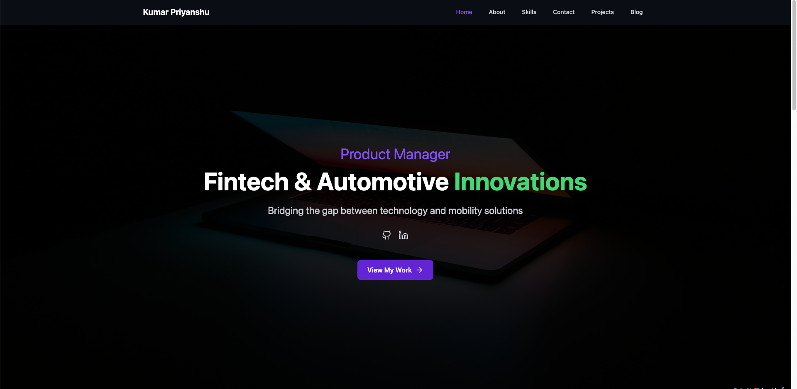

# Kumar Priyanshu | Product Manager Portfolio



## 🚀 Overview

A modern portfolio website showcasing my expertise as a Product Manager in the fintech and automotive industries. The site features a sleek dark theme with purple accents, responsive design, and smooth animations.

## ✨ Features

- **Responsive Design**: Optimized for mobile, tablet, and desktop devices
- **Modern UI**: Dark theme with purple and green accents for a professional yet contemporary look
- **Interactive Sections**: Dynamic components with smooth transitions and animations
- **Multi-page Layout**: Dedicated pages for Projects and Blog content
- **React + TypeScript**: Built with modern web technologies for performance and type safety

## 🛠️ Technologies Used

- **Frontend Framework**: React 18 with TypeScript
- **Styling**: Tailwind CSS for utility-first styling
- **UI Components**: Shadcn UI component library
- **Routing**: React Router for seamless navigation
- **Animation**: Custom CSS animations and transitions
- **Icons**: Lucide React for modern, consistent iconography
- **Data Visualization**: Recharts for presenting data
- **Build Tool**: Vite for fast development and optimized production builds

## 📱 Pages

- **Home**: Overview with hero section, about me, skills, and contact form
- **Projects**: Showcase of fintech and automotive product management work
- **Blog**: Thoughts and insights on product management, fintech, and automotive innovation

## 🖥️ Development

### Prerequisites

- Node.js 16+
- npm or yarn

### Getting Started

```bash
# Clone the repository
git clone <repository-url>

# Navigate to the project directory
cd portfolio-website

# Install dependencies
npm install

# Start the development server
npm run dev
```

### Building for Production

```bash
# Build the application
npm run build

# Preview the production build
npm run preview
```

## 📚 Project Structure

```
portfolio-website/
├── public/              # Static assets
├── src/
│   ├── components/      # Reusable UI components
│   ├── hooks/           # Custom React hooks
│   ├── lib/             # Utility functions and constants
│   ├── pages/           # Page components
│   └── App.tsx          # Main application component
├── tailwind.config.ts   # Tailwind CSS configuration
└── vite.config.ts       # Vite configuration
```

## 🔄 Deployment

The site is ready to be deployed on platforms like Netlify, Vercel, or GitHub Pages. For deployment instructions, visit the [Lovable documentation](https://docs.lovable.dev/tips-tricks/custom-domain/).

## 📧 Contact

- LinkedIn: [kpriyanshu](https://linkedin.com/in/kpriyanshu)
- GitHub: [priyanshukumar0309](https://github.com/priyanshukumar0309)

## 🙏 Acknowledgements

Built with [Lovable](https://lovable.dev) - an AI-powered web development platform.

## 📄 License

MIT © Kumar Priyanshu
